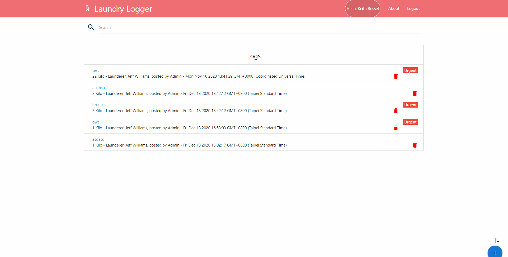

# Laundry-logger

A Simple laundry logger app to use to track the logs of laundry sets.
Check the [sample link](https://desolate-shelf-62199.herokuapp.com/)



## Installation

```bash
npm install
```

## Usage

```base
npm run client #run client side only
npm run server #run server side
npm run dev #both client & server
```

## Dependencies Server Side

bcryptjs, config, express, express-validator, jsonwebtoken, mongoose

## Dependencies Client Side

materializecss, axios, react-materialize, react-transition-group, react-uuid

## Credits

Reconstruct my own UI and some function.
Thanks to Brad Traversy Crash Courses I learned a lot.
